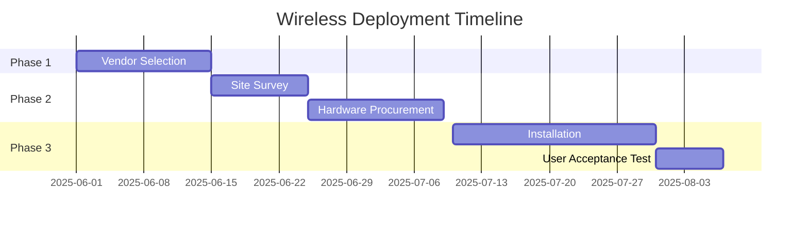

# Request for Proposal (RFP): Enterprise Wireless Infrastructure Deployment

**Issued by**: [MITT-NSA-W24]  
**RFP Release Date**: [03-27-2025]  
**Response Due Date**: [03-27-2025 + 30 Days]  

---

## 1. Organization Vision and Background
### 1.1 Company Overview
MITT is a technology company dedicated to global network layout. The company was founded in 2008, and its business has spread to more than 100 countries around the world, which is deeply loved by official Internet users. MITT is a company that provides comprehensive and diverse network services. In 2024, the company's revenue reached 130 million US dollars, and its service direction gradually shifted to the field of cutting-edge technology, especially fascinated by the field of space exploration.

### 1.2 Strategic Objectives
- Enable seamless connectivity for 300+ concurrent devices
- Support IoT expansion (projected 50+ devices by 2025)
- Achieve 99.99% network uptime SLA
- Implement Zero Trust security framework
- Next generation intelligent network for achieving ground to air connectivity

---

## 2. Scope of Work
### 2.1 Technical Implementation
- Site survey to determine optimal access point placement
- Installation and configuration of wireless access points
- Integration with existing wired network
- Ongoing maintenance and support

### 2.2 Maintenance Requirements
- 24/7 remote monitoring
- 4-hour onsite response SLA for critical issues
- Quarterly performance audits

---

## 3. Technical Requirements
- Coverage throughout the office premises
- Support for latest wireless standards (e.g., Wi-Fi 6)
- Robust security features, including WPA3 and MAC address filtering
- Capacity to handle high number of simultaneous connections
- Network monitoring and management capabilities

---

## 4. Project Timeline
### 4.1 Key Milestones

---

## 5. Vendor Selection Criteria

### 5.1 Evaluation Matrix

| Criteria              | Weight | Description                                                                 |
|-----------------------|--------|-----------------------------------------------------------------------------|
| Technical Solution    | 35%    | Alignment with performance/security requirements                           |
| Implementation Plan   | 25%    | Realistic timeline with risk mitigation                                     |
| Cost Structure        | 20%    | TCO analysis over 5-year period                                             |
| Support Capabilities  | 15%    | SLA commitments and regional presence                                       |
| References            | 5%     | Verified enterprise deployments                                             |

### 5.2 Submission Requirements

- Detailed network topology diagram
- Bill of Materials (BoM) with OEM certifications  
- 3-Year cost projection (CAPEX/OPEX breakdown)
- Case studies of similar deployments (500+ user environments)

---

## 6. Response Guidelines

### 6.1 Submission Format

- **Primary Document**:  
  `PDF format` (max 50 pages)  
  File naming convention: `[VendorName]_Technical_Proposal.pdf`

- **Financial Proposal**:  
  `Excel format` with cost breakdown  
  File naming: `[VendorName]_Financials.xlsx`

- **Technical Diagrams**:  
  Accepted formats: `.vsdx` (Visio) or `.drawio`  
  Max file size: `20MB per diagram`

### 6.2 Evaluation Process

1. **Initial Screening** (1 day)  
   - Compliance check against mandatory requirements
   - Document completeness verification

2. **Technical Review** (2-5 days)  
   - Cross-functional team evaluation
   - Proof-of-Concept validation (if required)

3. **Shortlist Presentations** (6-12 days)  
   - Onsite/remote demonstrations
   - Reference checks

4. **Final Negotiations** (12-14 days)  
   - Contract finalization
   - SLA alignment sessions

---

## 7. Contact Information

**RFP Coordinator**  
**Name**: `[Almas Borjigin]`  
**Title**: `[Tender Director]`  
📧 `[AlmasBorjigin@gmail.com]`  
📞 `+1 (204) 666-8888`  

**Technical Questions**  
**Contact**: `[Felix]`  
📧 `Felix@mitt-nsa-w24.com`  

**Submission Portal**  
🔗 [Secure Upload Link](https://mitt-nsa-w24.com/rfp-upload)  
⏰ Deadline: `[04-27-2025] 17:00 EST`  

❗ **Late submissions will not be accepted**

